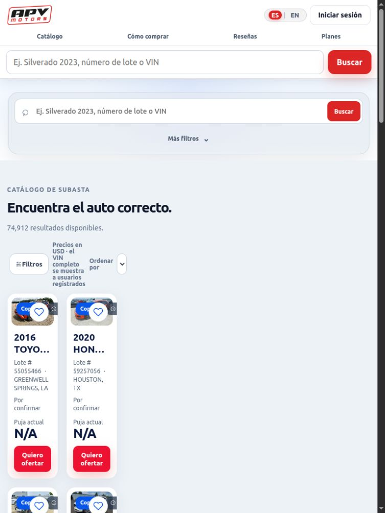
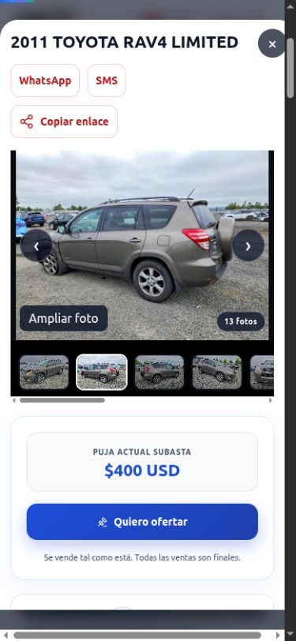
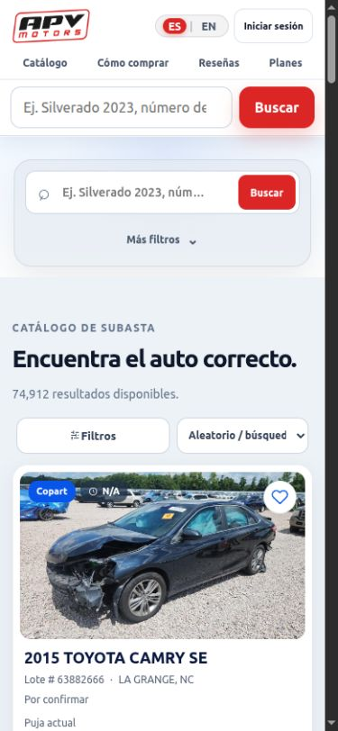

# Auditoría de interfaz, experiencia de compra y conversión — APV Motors

**Fecha:** 29 de septiembre de 2026.\
**Versión revisada:** copia local, commit `ff2ecd7`.\
**Proyecto en ejecución:** <http://localhost:3015> · visitante sin sesión: <http://127.0.0.1:3015>.\
**Método:** navegación e interacción real en Chrome, capturas, inspección del DOM y comprobaciones puntuales del código y de los datos locales.\
**Entrega:** diagnóstico y propuesta de mejoras. No se modificó la interfaz ni se desplegaron cambios.

> Actualización: las correcciones posteriores y las decisiones del propietario están en [Correcciones para revisión](CORRECCIONES_UI_UX_2026-09-29.md). Este documento conserva el diagnóstico original.

## 1. Dictamen

**La interfaz todavía no cumple el objetivo de ser sencilla, consistente y libre de redundancias.** La portada tiene una propuesta reconocible, buenos espacios y una acción principal visible. Las tarjetas nuevas facilitan la exploración. Sin embargo, el recorrido completo introduce búsquedas duplicadas, información comercial inconsistente y barreras antes de conocer el costo de una compra.

Hay dos problemas que deben resolverse primero: **las horas y los estados temporales de subasta pueden ser incorrectos**, y **el catálogo se comprime hasta resultar difícil de usar a 768 px de ancho**. Ningún ajuste de mensajes de venta compensa esos errores.

La recomendación comercial es orientar el recorrido hacia una sola decisión por etapa: **encontrar un vehículo → entender su condición y costo → solicitar ayuda para comprarlo**. Las membresías, el historial, los favoritos y compartir deben apoyar ese recorrido, sin competir constantemente con él.

**Balance:** 32 hallazgos: 2 P0, 17 P1, 11 P2 y 2 P3. Incluye 19 capturas principales y evidencias de texto/configuración. Las prioridades reflejan impacto estimado en la experiencia; no son tasas de abandono medidas.

### Decisiones recomendadas antes de atraer más tráfico

1. Corregir fechas, cuenta regresiva y consistencia entre destacados, catálogo y ficha.
2. Reparar el catálogo en tamaños intermedios y el desbordamiento de la ficha móvil.
3. Completar la licencia y confirmar las condiciones del depósito publicadas como definitivas.
4. Unificar búsqueda y filtros; mantener daños, título y millaje resumidos junto al precio.
5. Aclarar qué incluye el costo estimado y dar continuidad a “Compra inmediata”.
6. Reducir interrupciones de membresía y adaptar el registro a la intención del visitante.
7. Corregir foco, etiquetas accesibles, contraste y recuperación de contraseña.

### Lo que conviene conservar

- La portada explica que APV puja por el comprador y lo acompaña hasta la entrega.
- El catálogo puede explorarse sin registro.
- La fotografía, el nombre y el precio tienen una jerarquía reconocible en las tarjetas a 390 y 1440 px.
- Las tarifas APV están desglosadas por tramos; la renovación anual aparece en los planes.
- El presupuesto separa la reserva para gastos adicionales de la compra estimada.
- El estado sin resultados permite limpiar filtros; la página 404 ofrece volver al catálogo.
- La galería, las preguntas frecuentes, el carrusel de reseñas y el cambio ES/EN funcionan en las interacciones probadas.
- Las reseñas muestran una fecha para la calificación archivada, en lugar de presentarla como una consulta en vivo.

## 2. Alcance y límites de la validación

### Tamaños utilizados

| Tamaño de viewport en Chrome | Uso | Resultado principal |
|---|---|---|
| 1440 × 900 | Computadora | Portada, catálogo, ficha, acceso, campañas, costos y reseñas revisados. |
| 390 × 844 | Móvil principal | Portada, catálogo, filtros, ficha, registro, planes, campañas y cookies revisados. |
| 320 × 740 | Móvil pequeño | Catálogo, registro y teclado revisados; controles y textos más apretados. |
| 768 × 1024 | Tamaño intermedio | Fallo grave de distribución del catálogo reproducido. |
| 820 × 1180 | Tamaño intermedio superior | El catálogo recupera dos columnas utilizables, aunque el bloque de filtros inicial ocupa mucho espacio. |

Son pruebas de adaptación mediante el tamaño de Chrome de escritorio. **No equivalen a pruebas en iPhone/Android físicos**, teclado virtual, Safari, lector de pantalla ni gestos táctiles reales. La barra de desplazamiento de este entorno consume aproximadamente 15 px; las medidas de contenido distinguen ese espacio del ancho del viewport.

### Recorridos probados

| Superficie o interacción | Validación realizada | Límite |
|---|---|---|
| Inicio `/` | Jerarquía, navegación por anclas, costos, reseñas, presupuesto, FAQ y planes; ES/EN. | No se midió conversión con usuarios reales. |
| Catálogo `/catalogo` | Carga, búsqueda inexistente, limpiar, marca Toyota, modelos dependientes, orden por año, apertura de ficha. | No se recorrieron los 74.912 lotes del inventario local. |
| Filtros móviles | “Más filtros”, panel “Filtros” y cierre con Escape. | No se verificaron todas las combinaciones posibles. |
| Ficha | Lotes 54448506 y 64228046; galería, datos, precios, compra inmediata, calculadora bloqueada y con sesión. | No se confirmó disponibilidad real con Copart. |
| Oferta anónima | Apertura del registro y mensaje contextual. | Sin crear cuentas ni enviar correos. |
| Oferta con sesión existente | Promoción de membresía, “Continuar gratis”, formulario y desglose con US$5.000. | Sin enviar la intención de puja, abrir una conversación comercial ni efectuar pagos. |
| Favorito anónimo | Abre acceso con explicación de que permite guardar favoritos. | No se añadieron favoritos a la cuenta existente. |
| Planes | Contenido, renovación, selección de APV Plus por visitante y acceso al registro. | Sin abrir ni completar Checkout de Stripe. |
| Campañas `/lp` | Variante predeterminada, primera vez y conocedor; presupuesto, tarjeta, CTA fijo y enlace a ficha. | No se realizó un ensayo estadístico de las variantes. |
| Video | Reproducción del inglés hasta 7,3 s; cambio a español pausa y reinicia. | No se verificó toda la transcripción ni si existen subtítulos incrustados dentro del video. |
| Cookies y textos informativos | Apertura, contenido y selección de “Solo esenciales”; términos y privacidad. | No se certifica cumplimiento jurídico ni recepción de eventos en proveedores. |
| Página inexistente | Mensaje, buscador y enlace de recuperación. | Revisión visual, no auditoría completa de SEO técnico. |

Se utilizó el origen `127.0.0.1` para observar el recorrido sin sesión y `localhost` para inspeccionar la sesión local ya existente. No se cerró esa sesión. No se inspeccionó almacenamiento de autenticación ni se publicaron credenciales. El panel administrativo, las cuentas Premium/Plus, correos entregados, CRM y facturación completada quedan fuera de la validación de extremo a extremo.

**Comprobación complementaria:** `npm test` aprobó **54/54 pruebas**. Esto no acredita la calidad visual: el error a 768 px y los problemas de contexto comercial siguieron presentes. [Resultado de pruebas](qa/auditoria-2026-09-29/pruebas-automaticas.txt). Las consultas a la consola mediante la herramienta no devolvieron errores ni advertencias; no es una captura completa de red ni una medición de rendimiento. [Registro](qa/auditoria-2026-09-29/consola.json).

## 3. Registro priorizado de hallazgos

**P0:** corregir antes de considerar validada la experiencia. **P1:** impacto alto en confianza, acceso o intención de compra. **P2:** simplificación, claridad o mejora comercial. **P3:** acabado. “Observado” indica evidencia en Chrome; “código/configuración” indica corroboración local; “propuesta” indica una recomendación cuyo impacto comercial aún debe medirse.

| ID | Prioridad | Hallazgo | Evidencia y alcance | Acción recomendada |
|---|---|---|---|---|
| H01 | P0 | Hora de subasta y “Fecha cumplida” incorrectas. | Observado y corroborado en datos/código; lotes 54448506 y 53788996. | Usar un único instante de subasta con zona horaria para hora, orden y contador. |
| H02 | P1 | Destacados muestran “N/A / Por confirmar” aunque la ficha tiene fecha. | Home y `/lp`; lote 64228046. | Completar el contrato de datos de destacados y reutilizar el mismo formato de ficha. |
| H03 | P0 | Catálogo inutilizable en parte del rango intermedio. | A 768 px: contenido de 220 px y tarjetas de 102 px. | Unificar los puntos de cambio del contenedor, filtros y cuadrícula. |
| H04 | P1 | Desplazamiento horizontal en la ficha móvil. | A 390 px: diálogo de 375 px con contenido de 390 px. | Eliminar anchos de viewport incompatibles con el contenedor y revisar la galería. |
| H05 | P1 | `[LICENCIA_NO]` publicado. | Pie de home, catálogo y campañas; variable ausente. | Configurar la licencia verificada o retirar temporalmente el campo incompleto. |
| H06 | P1 | Afirmación absoluta “Solo concesionarios con licencia”. | `/lp`, español e inglés. | Explicar las restricciones según lote/estado y el servicio real de APV. |
| H07 | P1 | Condiciones provisionales del depósito se muestran como definitivas. | Configuración `provisional: true`; interfaz: 10 %, mínimo US$600. | Confirmar reglas, plazos y excepciones antes de reforzar este argumento de venta. |
| H08 | P1 | Buscadores y filtros duplicados. | Dos búsquedas; marca/modelo/estado/años repetidos; “Más filtros” y “Filtros” en móvil. | Un buscador y un único sistema de filtros. |
| H09 | P2 | El orden inicial no ayuda a encontrar opciones comprables. | Aleatorio; numerosos lotes sin puja/fecha, camiones y otras categorías. | Priorizar datos completos y disponibilidad; dar acceso claro al tipo de vehículo. |
| H10 | P1 | Modelos y estados poco comprensibles o inconsistentes. | Toyota ofrece “CAMRRY”, “COROALLA”, “CIVIC LX-S”; ficha muestra “OR · LS” y “On Minimum Bid”. | Normalizar categorías y añadir etiquetas humanas conservando el dato original. |
| H11 | P1 | Tarjeta compacta oculta datos esenciales para valorar el precio. | Daño, título y odómetro aparecen solo al abrir la ficha. | Añadir una línea breve con condición relevante, documento y millaje. |
| H12 | P1 | “Compra inmediata” no continúa como compra inmediata. | Tarjeta de US$600 abre ficha dominada por puja de US$200 y “Quiero ofertar”. | Conservar modalidad e importe; ofrecer “Solicitar compra por US$600” tras verificar disponibilidad. |
| H13 | P1 | Comparación de 92,9 % puede parecer ahorro final. | Lote 64228046; exclusiones solo en atributo `title`, texto de 10 px. | Mostrar “Precio del lote, sin gastos ni reparación” y “valor estimado” junto a la comparación. |
| H14 | P1 | Calculadora detallada bloqueada antes de demostrar valor. | Visitante puede usar presupuesto general, pero debe registrarse para calcular una ficha. | Probar estimación básica pública; reservar registro para guardar o solicitar. |
| H15 | P1 | Se promete costo “exacto” y luego se presenta una estimación incompleta. | Acceso a calculadora y total; transporte/impuestos excluidos. | Usar “estimación de compra” y exclusiones visibles junto al importe. |
| H16 | P1 | Modal de membresías interrumpe la intención de ofertar. | Sesión gratuita → “Quiero ofertar” → promoción → “Continuar gratis” → formulario. | Integrar ahorro opcional dentro del resumen, sin imponer una pantalla previa. |
| H17 | P1 | No hay recuperación de contraseña visible. | Login de home/catálogo; sin ruta de recuperación encontrada en el servidor revisado. | Implementar “Olvidé mi contraseña” y su flujo completo. |
| H18 | P2 | Registro genérico y detalles internos en el mensaje. | “Guarda tu conversación…” para planes/favoritos/pujas; mención de Kommo. | Título y explicación según intención; conservar lote, importe y plan. |
| H19 | P2 | Formulario exige datos con poca ayuda contextual. | Teléfono obligatorio; ejemplo venezolano con prefijo +1; mínimo de contraseña no explicado. | Aclarar formato y necesidad; ejemplo según país, mínimo visible y mostrar contraseña. |
| H20 | P1 | Controles sin nombre accesible suficiente. | Teléfono anunciado por placeholder; ordenar aparece como `combobox` sin nombre en móvil. | Etiquetas explícitas para teléfono y ordenación. |
| H21 | P1 | El foco sale del modal de autenticación. | Tab desde el último botón y otro Tab llevan al logo del fondo. | Contener el foco, volver al disparador y hacer inerte el contenido posterior. |
| H22 | P1 | Contraste insuficiente en textos del acceso. | Ayuda: 2,56:1; pestaña inactiva: 4,34:1, ambas con texto pequeño. | Ajustar colores; verificar 4,5:1 para texto normal. |
| H23 | P2 | Áreas táctiles demasiado pequeñas en navegación/idioma. | En móvil: enlaces de 13 px de alto; ES/EN de 18 px. | Ampliar área interactiva a un objetivo cómodo de 44 × 44 px, sin agrandar todo el texto. |
| H24 | P2 | Portada larga y planes repetitivos. | Aproximadamente 10.220 px de alto en móvil; planes ocupan 2.550 px. | Declarar beneficios comunes una vez y resumir diferencias. |
| H25 | P2 | Evaluación repite el mismo argumento y simula controles. | “Una buena foto…” y “Una foto no basta”; “Revisar →” es decoración. | Un único argumento, muestra útil de reporte y una acción real. |
| H26 | P2 | Landing desvía al usuario experto. | “Quiero buscar mi auto” lleva a `/`, no al catálogo; promesa de búsqueda sin campo en hero. | Enlazar al catálogo conservando campaña; diferenciar recorrido experto y principiante. |
| H27 | P2 | Traducción y terminología todavía incompletas. | Plan “Gratis” en EN; “fees”, “Retail”, “On Minimum Bid” en ES. | Glosario consistente y revisión de estados dinámicos, no solo portada. |
| H28 | P2 | Reseñas con controles aparentes y encabezado repetido. | “Todas las reseñas” parece una pestaña, pero es estático; múltiples accesos a Google. | Resumen, reseñas seleccionadas y un enlace a Google; nombrar la selección correctamente. |
| H29 | P2 | Aviso de cookies difícil de leer en móvil. | Texto de una línea truncado en la captura; “Aceptar todas” domina visualmente. | Frase breve legible, sin truncar y con opciones claras. |
| H30 | P3 | Fragmentos de texto concatenados sin espacios. | “puja.10 %…US$600.Se…” y “¿Compras con frecuencia?Compara…”. | Corregir composición de fragmentos y revisar ES/EN. |
| H31 | P2 | Video sin pistas de subtítulos seleccionables. | DOM: cero elementos `track`; interfaz anuncia reproducción con sonido. | Añadir subtítulos ES/EN y acceso a transcripción. |
| H32 | P3 | La página 404 pierde el acabado del producto. | Campo de búsqueda con apariencia nativa y alineación rudimentaria. | Reutilizar el componente de búsqueda y espaciado del sitio. |

Las recomendaciones de apertura de calculadora, jerarquía de planes y orden del inventario son decisiones de producto; no se presentan como errores de programación ni como mejoras de conversión ya demostradas.

## 4. Problemas funcionales que requieren corrección

### H01. La hora mostrada no representa el instante real guardado

**Reproducción:** abrir catálogo, elegir Toyota y buscar; revisar el lote 54448506. La tarjeta mostró **29 sept 2026, 9:00 a. m. PDT** y **“Fecha cumplida”**. Los datos locales contienen fecha `20260929`, hora `1200`, zona `PDT` e instante correspondiente a **12:00 PDT**. Para el lote 53788996, la base contiene **10:00 EDT** del 30 de septiembre, mientras la tarjeta mostró **12:00 p. m. EDT**.

La causa está corroborada: `toPublic()` construye `saleDate` con `T12:00:00` sin zona, mientras `auctionCardDate()` y `auctionTimeLabel()` derivan de ese valor la hora y el tiempo restante. El campo `saleTime` existente no participa en esa presentación.

**Impacto:** un comprador puede descartar un vehículo que aún admite gestión o confiar en una hora equivocada. El estado de subasta no debería deducirse únicamente de que su hora de inicio haya pasado: “fecha cumplida” tampoco confirma “vendido”.

**Corrección:** usar `saleAt` o un ISO con zona calculado desde fecha/hora/zona originales; separar hora de inicio, cierre y estado comercial confirmado. Mostrar hora del patio y, opcionalmente, hora local del visitante con etiquetas inequívocas.

**Aceptación:** el mismo lote tiene fecha y hora idénticas en tarjeta, destacados, ficha y ordenación; el contador conserva el instante al cambiar la zona del navegador; no aparece “cerrada/vendida” sin evidencia de estado. Probar fechas sin hora, zonas distintas y cambios de horario estacional.

**Evidencia:** [datos de lotes](qa/auditoria-2026-09-29/fechas-lotes.json), [ficha y catálogo filtrado](qa/auditoria-2026-09-29/ficha-desktop.txt). Código: [catalogDb.js](../services/catalogDb.js), función `toPublic`; [app.js](../public/app.js), `auctionCardDate` y `auctionTimeLabel`.

### H02. Los destacados pierden la fecha

La tarjeta del Corolla 64228046 en `/lp` mostraba “N/A” y “Por confirmar”; al abrirla, la ficha mostraba fecha del 29 de septiembre. No es únicamente falta de datos del proveedor: `getFeaturedVehicles()` entrega `saleAt`, pero el componente de tarjeta consulta `saleDate` y `timeZone`, que no recibe.

Además, la portada anuncia **“Autos en subasta esta semana”** sin que su selección garantice ese intervalo. Corregir el dato y filtrar realmente por semana, o cambiar el título a **“Vehículos destacados”**. Si la fecha no está disponible, mostrar **“Fecha pendiente de confirmar”** una sola vez y retirar el contador vacío.

**Aceptación:** cero “N/A” temporales causados por un campo omitido; el título de la sección representa su selección real. [Captura de campaña](qa/auditoria-2026-09-29/14-lp-oferta-mobile.png).

### H03. El catálogo se rompe a 768 px

Al visitar `/catalogo` a **768 × 1024**, el contenedor conserva dos columnas de **220 y 487 px**, pero los filtros están ocultos y el contenido ocupa la columna de 220 px. Dentro se dibujan dos tarjetas de **102 px**. El resultado deja gran parte de la pantalla vacía y recorta títulos, imágenes y controles.

A **820 px** las tarjetas recuperaron **253,5 px**; a **390 y 320 px** aparece una columna normal. Esto sitúa el defecto en la coordinación entre reglas de adaptación, no en una falta general de espacio.

**Corrección:** cuando el filtro pasa a panel móvil, el contenedor principal debe pasar también a una columna. La cantidad de tarjetas debe depender del espacio disponible, con un ancho mínimo utilizable. Revisar especialmente el intervalo entre los puntos de cambio de 700 y 768 px; los extremos exactos del fallo aún deben medirse después de corregir.

**Aceptación:** probar 700, 701, 767, 768, 769, 820, 1024 y 1440 px; sin columnas vacías ni tarjetas tan estrechas que el nombre y el precio dejen de ser utilizables.

[Mediciones](qa/auditoria-2026-09-29/tablet-layout.json) · [Comparación a 820 px](qa/auditoria-2026-09-29/18-catalogo-820.png). Revisar `.catalog-shell`, `.filters` y `.vehicle-list` en [styles.css](../public/styles.css) y [campaign.css](../public/campaign.css).

### H04. Ficha móvil con desplazamiento lateral

Con el lote 54448506 abierto a 390 px, el diálogo tenía **375 px de ancho visible y 390 px de contenido**. La captura muestra una barra horizontal general, además del desplazamiento de miniaturas de la galería.

El desplazamiento horizontal de miniaturas es razonable; el del diálogo completo dificulta leer, cerrar y continuar. Ajustar `width`, `max-width`, `min-width` y el modelo de caja; evitar que un descendiente de ancho `100vw` desborde el contenedor con scrollbar.

**Aceptación:** `scrollWidth <= clientWidth` en el cuerpo de la ficha para 320, 360, 390 y 430 px; desplazamiento lateral únicamente dentro de la galería. Botón de cierre siempre visible y operable.

## 5. Recorrido de compra y oportunidades de conversión

### 5.1 Portada: buena entrada, demasiadas decisiones después

El hero actual comunica actividad, intermediación y acompañamiento. No hace falta sustituirlo por una interfaz más cargada. El problema es la acumulación posterior: destacados, reseñas, presupuesto, evaluación, tarifas, depósito, tres planes extensos, diez preguntas y otro cierre comercial.

La longitud por sí sola no es un defecto. Aquí se suma a repeticiones concretas: las tres membresías reiteran beneficios comunes; la evaluación dice dos veces que una foto no basta; el depósito reaparece en el bloque, los casos y FAQ; catálogo, “Ver autos” y el botón del hero compiten en la primera pantalla de escritorio.

**Orden propuesto para la portada:**

1. Propuesta breve, una acción principal “Explorar vehículos” y una secundaria “Calcular presupuesto”.
2. Explicación en cuatro pasos, con una frase por paso.
3. Selección de vehículos con información suficiente para comparar.
4. Presupuesto y costos, con tarifa APV y depósito diferenciados.
5. Reseñas seleccionadas y respaldo verificable.
6. Preguntas frecuentes esenciales y cierre con asesor.

Los planes pueden conservarse como sección breve o página específica enlazada desde costos y cuenta. No es necesario obligar al comprador primerizo a comparar suscripciones antes de elegir un vehículo.

**Presupuesto:** US$10.000 de total y US$2.000 de reserva devolvieron US$6.637 de tope, US$8.000 de compra estimada y US$10.000 total orientativo. El error al indicar US$1.000 y US$2.000 de reserva apareció correctamente. Mejorar la ayuda de la reserva: una persona nueva no necesariamente sabe estimar transporte, reparación e impuestos. Ofrecer una explicación desplegable y “Necesito ayuda para estimar estos gastos”. No rellenar importes ficticios para producir un resultado atractivo.

### 5.2 Catálogo: una sola herramienta para buscar

**Estructura recomendada:**

- Un campo “Marca, modelo, lote o VIN”.
- Una fila breve de filtros de uso frecuente y un botón “Todos los filtros”.
- Recuento, filtros activos eliminables y ordenación claramente nombrada.
- Resultados inmediatamente después.
- En móvil, un único panel de filtros; “Ver resultados” al final y recuento actualizado.

Mantener el estado al abrir/cerrar una ficha y al volver atrás. El flujo observado conservó el filtro Toyota al cerrar la ficha; preservar ese comportamiento.

Reemplazar “Estado” por **“Estado de ubicación”** para no confundirlo con condición del vehículo. Mostrar **“Sin límite”** cuando el límite de odómetro esté apagado, en lugar de “0 mi”. Desactivar o guiar el selector de modelo hasta elegir marca; limpiar alias, versiones duplicadas, errores y categorías impropias sin inventar datos.

La selección inicial aleatoria con muchos “N/A” comunica falta de mantenimiento. Priorizar vehículos con foto, descripción útil y datos recientes; incluir tipo de vehículo cuando el inventario mezcla automóviles, motocicletas, remolques y camiones. El orden “más nuevo” mostró un remolque de 2027: técnicamente es coherente con el inventario, pero no con la expectativa de alguien que busca “su próximo auto”.

### 5.3 Tarjeta: compacta, pero suficiente para decidir

Conservar foto, nombre, ubicación y precio. Añadir **una línea de riesgo y condición**, por ejemplo:

> Daño frontal · Título de salvamento · 139.090 mi

No multiplicar insignias ni devolver toda la ficha técnica a la tarjeta. Esa línea evita que la simplificación visual oculte las razones por las que un precio es bajo. “Prende y corre” requiere una explicación breve de su alcance; no debe presentarse como garantía de estado mecánico.

Para precios ausentes, usar **“Puja no informada”** y **“Consultar disponibilidad”** o **“Ver detalles”**, según el estado real. No convertir un precio cero/no informado en una oferta de US$0, ni utilizar urgencia si no hay una fecha confiable.

En la comparación de compra inmediata, conservar que el cálculo utiliza Buy Now y no la puja actual. Sin embargo, el **92,9 %** frente a US$8.489 necesita contexto legible. El Corolla observado tiene **284.691 mi** en su ficha: el valor de referencia no explica por sí mismo la condición, el millaje o la conveniencia de compra.

**Presentación propuesta:** “Compra inmediata: US$600” y debajo “Referencia de mercado estimada: US$8.489”. Si se mantiene el porcentaje, nombrarlo **“Diferencia frente al valor estimado”**, con exclusiones visibles. No anunciar “ahorro final” sin costo completo comparable.

### 5.4 Ficha: evaluación primero, acciones secundarias después

La ficha de escritorio divide la información en muchas cajas y la móvil coloca WhatsApp, SMS y copiar enlace antes de la fotografía. Esos enlaces son para **compartir**, no para contactar al asesor: el WhatsApp observado no tiene destinatario. El nombre actual puede inducir a pensar que inicia atención comercial.

**Orden recomendado:**

1. Nombre, lote, ubicación, fecha/hora y estado verificable.
2. Galería y un resumen visible de daños, título, condición y odómetro.
3. Puja actual o compra inmediata, con modalidad claramente diferenciada.
4. Estimación de compra, conceptos incluidos y exclusiones.
5. Acción principal contextual: solicitar puja o solicitar compra inmediata.
6. Datos técnicos ampliables; compartir agrupado en una sola acción secundaria.

“Estado de venta” y “Reserva del vendedor” mostraban el mismo valor `On Minimum Bid`. Mostrar una sola explicación, por ejemplo **“Sujeto a un mínimo del vendedor”**, una vez confirmada la correspondencia con el proveedor. Expandir códigos documentales con una etiqueta comprensible y conservar el código original como dato secundario.

**Compra inmediata:** la tarjeta de US$600 llevó a una ficha donde el importe más destacado era la puja de US$200. Mantener en el destino el contexto elegido; el siguiente paso debe explicar la solicitud por el importe de compra inmediata y verificar vigencia. No convertir ese botón en un cobro automático.

### 5.5 Calculadora: generar confianza antes del registro

La portada promete claridad de costos; la ficha exige una cuenta para ver el cálculo. Probar que el visitante pueda obtener una estimación básica sin registrarse y pedir la cuenta al guardar o solicitar. Medir el efecto sobre **solicitudes calificadas**, no solo el aumento o caída de registros.

Con sesión, US$5.000 produjeron **US$6.143**: US$5.000 de puja, US$664 de tarifas Copart, US$129 de otros cargos y US$350 APV. Ese total es útil, pero no es un precio final de entrega. Reemplazar:

> “Desglose exacto de tarifas y total a pagar”

por:

> **“Estima el costo de compra”**\
> Incluye tu tope y las tarifas calculadas. Transporte, impuestos locales y reparación se confirman por separado.

Mantener la exclusión junto al total, con tamaño legible. Reemplazar “fees” por “tarifas/cargos”. En parámetros, explicar “pago seguro”, “pago no garantizado”, “preoferta” y “oferta en vivo”; no exigir que el principiante conozca la nomenclatura de Copart. Presentar como datos, no como radios deshabilitados, el título y la categoría que ya vienen fijados por el vehículo.

Hay dos caminos: “Quiero ofertar” y “Ofertar con este tope”. Al calcular US$5.000 y usar el primero, el formulario de tope volvió vacío. Unificar la acción principal o preservar explícitamente el monto calculado para evitar volver a introducirlo. [Desglose observado](qa/auditoria-2026-09-29/calculadora-sesion.txt).

### 5.6 Registro y recuperación

El formulario de registro ocupa casi toda la altura móvil. El gran título sobre conversaciones no explica bien por qué se pide una cuenta al elegir un plan, guardar un vehículo o calcular una compra.

Usar títulos según intención:

| Origen | Título recomendado | Explicación |
|---|---|---|
| Favorito | Guarda este vehículo | Accede a tus favoritos desde cualquier dispositivo. |
| Solicitud de puja | Continúa con este vehículo | Guarda tu tope y revisa los próximos pasos con un asesor. |
| Plan Plus | Continúa con APV Plus | US$97 al año. Revisa los detalles antes del pago. |
| Historial | Solicita el historial de este vehículo | Indicar qué incluye, si tiene costo y cuándo se entrega, una vez confirmados. |

Sustituir la mención de **Kommo** por el beneficio para la persona. Ofrecer recuperación de contraseña y mostrar el requisito mínimo antes del error. Ajustar el ejemplo de teléfono al país seleccionado. Valorar si teléfono y nombre son indispensables para guardar un favorito; si no, solicitarlos cuando se pide atención comercial.

No se verificó envío de código, reenvío, código vencido ni activación real de cuenta. Deben incluirse en la siguiente validación con una cuenta de prueba y un buzón controlado.

### 5.7 Membresías sin frenar la compra

La promoción apareció antes de poder completar el tope. Ese momento es de alta intención: cambiar el objetivo a “comparar suscripciones” puede sacar al comprador de su vehículo.

Mostrar una opción breve dentro del resumen:

> **Puedes reducir US$100 de la tarifa APV con Plus.**\
> Plus cuesta US$97 al año y se paga por separado. Ver beneficios.

No llamar a US$100 “ahorro neto” sin descontar el precio del plan. No preseleccionar el plan ni ocultar el camino gratuito. Explicar qué asesoría incluye cada uno: Plus menciona 20 minutos y Premium 60 minutos; “ambos incluyen asesoría” es cierto pero insuficiente para comparar.

En la tabla de planes, declarar **“Todos incluyen inventario, favoritos y chat”** una vez. Mostrar tres o cuatro diferencias reales por plan. Sustituir la lista de cruces del plan gratis por una descripción positiva y breve de su utilidad. Mantener precio anual, renovación y cancelación junto al botón.

### 5.8 Campañas: un recorrido acorde con la promesa

La variante para expertos dice “Busca por lote o VIN”, pero no ofrece búsqueda en el hero; además “Quiero buscar mi auto” lleva a la portada. Enlazar directamente al catálogo con el contexto de campaña preservado.

La variante para principiantes incluye “Subastas en 3 fases” y después “Así compras, en 4 pasos”. El primer bloque explica qué es el servicio, no tres fases de compra. Renombrarlo **“Qué hace APV por ti”** y conservar un solo proceso de cuatro pasos.

En escritorio, el video domina la primera pantalla y el CTA principal queda más abajo en la variante revisada. Mantener visible una acción de exploración junto al texto del hero, además del video. En móvil no agregar otra barra fija si compite con cookies o tapa controles.

No afirmar que solo concesionarios pueden pujar: Copart ofrece lotes “No License Required” y explica el papel del intermediario. El diferencial de APV puede ser acceso a lotes sujetos a restricciones, evaluación y acompañamiento, sin exagerar la exclusividad. [Fuente oficial de Copart](https://www.copart.com/content/us/en/landing-page/about-brokers).

Texto propuesto, sujeto a validación de operación:

> Algunos lotes requieren licencias específicas. APV revisa los requisitos del vehículo y te acompaña en la compra.

Esta auditoría no copia ni recomienda reproducir la interfaz de un competidor. La consulta externa se utilizó para contrastar una afirmación comercial concreta.

## 6. Alertas y microtextos que ayudan a vender con claridad

Los siguientes textos son **propuestas**, no mensajes implementados. Los de éxito deben mostrarse únicamente cuando la operación realmente se haya confirmado.

| Situación | Mensaje recomendado | Acción y regla |
|---|---|---|
| Precio no informado | “La subasta aún no informa una puja para este vehículo.” | “Ver detalles”; no inventar US$0. |
| Fecha pendiente | “Fecha de subasta por confirmar.” | “Consultar disponibilidad”; no mostrar cuenta regresiva. |
| Hora de inicio superada, estado desconocido | “Estamos confirmando el estado de este lote.” | Revisar disponibilidad; no deducir que fue vendido. |
| Cuenta necesaria para favorito | “Guarda este vehículo y vuelve a él cuando quieras.” | “Crear cuenta gratis” y “Ya tengo cuenta”. |
| Tope inválido | “Introduce un tope de puja mayor que US$0.” | Error junto al campo; conservar el resto de datos. |
| Reserva mayor que presupuesto | “La reserva debe ser menor que tu presupuesto total.” | Marcar reserva y total; evitar un error genérico. |
| Solicitud confirmada | “Recibimos tu solicitud para el lote {lote}, con tope de {importe}. Revisa los próximos pasos con tu asesor.” | Mostrar seguimiento solo si la solicitud está persistida. |
| Solicitud fallida | “No pudimos registrar tu solicitud. Tu tope sigue aquí.” | “Reintentar”; no presentar éxito ni perder el importe. |
| Sesión vencida | “Tu sesión terminó. Inicia sesión para continuar con este vehículo.” | Recuperar lote, modalidad e importe al volver. |
| Compra inmediata | “Solicitar compra por {importe}” | “Sujeto a disponibilidad. Consulta los gastos adicionales.” |
| Verificación por correo | “Enviamos un código a {correo parcialmente oculto}.” | Cambiar correo, reenviar con plazo visible y ayuda si no llega. |
| Venta adicional de Plus | “Con Plus reduces {descuento} de la tarifa APV de esta compra.” | Precio anual y enlace discreto; continuar sin membresía disponible. |

Evitar alertas genéricas tipo “Error”, modales promocionales repetidos, cuenta regresiva sin fecha confiable y mensajes que prometan respuesta inmediata sin un tiempo de atención confirmado. Un buen mensaje comercial reduce incertidumbre y deja claro el próximo paso.

## 7. Accesibilidad y legibilidad

Esta es una revisión parcial con evidencia; **no es una certificación WCAG** ni sustituye pruebas con tecnologías de asistencia.

| Comprobación | Resultado | Recomendación |
|---|---|---|
| Foco dentro del modal de acceso | Fallo: Tab desde el final permitió llegar al logo de la página de fondo. | Contención de foco, fondo inerte y retorno al botón que abrió el diálogo. |
| Escape | Cerró el panel de filtros y el acceso en las pruebas realizadas. | Conservar y extender de forma consistente a los demás overlays. |
| Teléfono del registro | Input sin etiqueta asociada propia; anunciado como “414 123 4567”. | `label for` o nombre accesible específico para teléfono; país por separado. |
| Ordenación móvil | En el snapshot aparece un combobox sin nombre. | Mantener etiqueta visible o accesible “Ordenar vehículos”. |
| Ayuda de código de correo | `#94A3B8` sobre blanco, 10 px, **2,56:1**. | Oscurecer y aumentar tamaño. |
| Pestaña inactiva del acceso | `#64748B` sobre `#F1F5F9`, 12 px, **4,34:1**. | Ajustar a al menos 4,5:1 para texto normal. |
| Botón rojo de verificación | Blanco sobre `#DC2626`, **4,83:1**. | Conservar contraste al cambiar estados. |
| Navegación móvil | Enlaces medidos con 13 px de alto; idioma de 18 px. | Ampliar padding/área activa; revisar separación entre objetivos. |
| Video | Sin pistas `track` observadas. | Subtítulos seleccionables y transcripción accesible. |
| Encabezado del catálogo | Título principal visible es H2; no se observó H1 visible. | Usar H1 para el propósito de la página; no convertirlo por sí solo en una afirmación de incumplimiento. |
| Fotografías | Texto alternativo descriptivo en tarjetas/ficha revisadas. | Conservar; añadir índice/estado al recorrer galería si ayuda. |
| Controles de paginación | Flechas generales “‹/›” en catálogo. | Nombres “Página anterior/siguiente” y estado actual accesible. |

[Mediciones de contraste](qa/auditoria-2026-09-29/accesibilidad-registro.json). W3C establece **4,5:1 para texto normal** y 3:1 para texto grande: [contraste mínimo](https://www.w3.org/WAI/WCAG22/Understanding/contrast-minimum.html). En objetivos táctiles, **24 × 24 px corresponde al mínimo de WCAG 2.2 AA con excepciones de separación**; 44 × 44 px se recomienda aquí como objetivo de comodidad y no se presenta como requisito general AA. [Tamaño mínimo](https://www.w3.org/WAI/WCAG22/Understanding/target-size-minimum), [etiquetas e instrucciones](https://www.w3.org/WAI/WCAG22/Understanding/labels-or-instructions.html).

Pendiente: lector de pantalla real, zoom de navegador a 200/400 %, movimiento reducido, navegación completa solo con teclado, teclado virtual, orientación horizontal y dispositivos físicos.

## 8. Configuración y contenido pendientes

Se comprobó **presencia o ausencia en `.env`**, sin exponer valores secretos. Tener una variable configurada no prueba que la integración funcione; una ausencia local no demuestra una ausencia en producción.

| Elemento | Estado comprobado | Trabajo pendiente | Responsable sugerido |
|---|---|---|---|
| `DEALER_LICENSE_NO` | Ausente y placeholder visible. | Confirmar número/entidad y configurar. | Operación + desarrollo |
| Depósito | 10 %, mínimo US$600; `provisional: true`. | Aprobar regla, aplicación, devolución, plazo y excepciones; alinear FAQ/términos. | Negocio + responsable legal |
| `PUBLIC_SITE_URL` | Ausente; existe un dominio predeterminado en código. | Confirmar dominio canónico efectivo del despliegue. | Desarrollo |
| `PUBLIC_APP_URL` | Configurado. | Verificar coincidencia con dominio de retorno de pagos y cuenta. | Desarrollo |
| Google Places | Clave e ID ausentes. | Configurar si se desean reseñas/calificación automáticas; validar ficha correcta. | Marketing + desarrollo |
| Calificación Google | Interfaz muestra 5,0/5 con fecha 27/09/2026. | Mantener fuente/fecha y proceso de actualización. No se revalidó la cifra en Google en esta auditoría. | Marketing |
| Selección de reseñas | 15 fragmentos; interfaz “Todas las reseñas”. | Cambiar a “Reseñas de clientes” o “Opiniones seleccionadas”; evitar implicar exhaustividad. | Marketing |
| GA4 | ID presente. | Confirmar eventos reales y consentimiento en DebugView; verificar atribución completa. | Marketing/analítica |
| Meta | Pixel ID y CAPI token ausentes. | Decidir activación; probar eventos, consentimiento y deduplicación antes de campañas. | Marketing/analítica |
| SMTP | Host, usuario, contraseña y remitente presentes. | Entrega real, reenvío, expiración y recuperación de cuenta con buzón de prueba. | Desarrollo |
| Stripe | Clave, webhook, precios Plus/Premium y portal presentes; parámetros de facturación presentes. | Validar en entorno de prueba alta, renovación, cancelación, error y retorno; no se ejecutaron cobros. | Desarrollo + negocio |
| Kommo | Token presente. | Validar registro confirmado, continuidad del chat y recuperación de error con un lead de prueba autorizado. | Ventas + desarrollo |
| Datos de inventario | 74.912 lotes locales al revisar; metadatos sucios y fechas inconsistentes. | Normalización, actualización, trazabilidad de hora/estado y retirada de lotes no disponibles. | Datos + operación |
| Documentos informativos | Términos y privacidad visibles en modales. | Alinear con depósito, servicios, planes y condiciones reales; añadir acceso contextual desde acciones sensibles. | Negocio + responsable legal |
| Traducciones | Cambio ES/EN funciona; quedan residuos. | Traducir “Gratis”, vocabulario de tarifas y estados dinámicos; revisar mensajes de error y cuenta. | Contenido + desarrollo |
| Subtítulos | Sin pistas seleccionables en DOM. | Generar/revisar VTT ES/EN y transcripción. | Contenido |

[Inventario de configuración sin secretos](qa/auditoria-2026-09-29/configuracion-sin-secretos.json). No activar proveedores solo para eliminar una fila de pendientes: hacerlo cuando exista una finalidad, configuración correcta y validación de entrega.

## 9. Qué eliminar, fusionar y conservar

| Elemento actual | Decisión propuesta | Resultado esperado |
|---|---|---|
| Buscador fijo + buscador del bloque principal | Fusionar en uno. | Menos dudas sobre dónde buscar y más espacio para vehículos. |
| Filtros principales + laterales repetidos | Un solo estado y una sola presentación por tamaño. | Cambios predecibles y menos controles. |
| “Más filtros” + “Filtros” móvil | Fusionar. | Un acceso reconocible a todos los filtros. |
| Contador “N/A” + fecha “Por confirmar” | Una sola frase temporal útil. | Menos ruido y datos más honestos. |
| Estado de venta + reserva idénticos | Fusionar cuando expresen lo mismo. | Menos lectura repetida. |
| WhatsApp + SMS + copiar sobre galería | Agrupar en “Compartir vehículo”. | La compra y la evaluación recuperan prioridad. |
| Dos títulos similares de evaluación | Conservar uno con ejemplo de utilidad. | Explicación breve y creíble. |
| Beneficios comunes repetidos en tres planes | Declararlos una vez. | Comparación más rápida. |
| Modal de membresía antes de ofertar | Sustituir por bloque opcional contextual. | Menos abandono del vehículo elegido. |
| Tres explicaciones de calculadora/bloqueo | Un título, un resultado y una nota de alcance. | Jerarquía más clara. |
| “Todas las reseñas” estático + enlaces Google repetidos | Una etiqueta correcta y un enlace. | Menos falsa apariencia de controles. |
| FAQ | Conservar como ampliación, cerrar inicialmente. | Responder objeciones sin alargar todos los bloques. |
| Tarifas por tramo y exclusiones | Conservar. | Transparencia antes de solicitar. |
| Repetición de CTA al final de una página larga | Conservar si responde al mismo objetivo. | Repetición funcional, no redundancia innecesaria. |

## 10. Plan de ejecución y criterios de aceptación

### Etapa 1 — Restaurar confiabilidad

**Desarrollo/datos:** H01–H04. **Operación/contenido:** H05–H07.

- Fechas correctas, contador consistente y destacados completos.
- Catálogo usable en todos los puntos de cambio; ficha sin scroll lateral general.
- Sin placeholders públicos ni reglas provisionales presentadas como condiciones aprobadas.
- Afirmaciones de licencia y disponibilidad verificables.

No ampliar la adquisición basándose en precios o urgencia hasta completar esta etapa.

### Etapa 2 — Reducir fricción hasta la solicitud

**Producto, diseño y desarrollo:** H08–H19.

- Una sola búsqueda y un único acceso a filtros en móvil.
- Tarjeta con condición mínima suficiente; lista inicial coherente con la intención.
- Compra inmediata conserva modalidad/precio hasta el siguiente paso.
- Presupuesto y calculadora usan el mismo lenguaje de estimación.
- Registro contextual, recuperación de contraseña y continuidad del importe.
- Membresías opcionales y claras, sin desviar obligatoriamente el flujo.

### Etapa 3 — Acceso, contenido y acabado

**Diseño, contenido y desarrollo:** H20–H32, priorizando los P1 de accesibilidad antes de dar por cerrado el trabajo.

- Foco y nombres accesibles correctos; contraste legible.
- Áreas táctiles cómodas, cookies sin truncamiento y traducciones consistentes.
- Menos duplicación de planes, evaluación y reseñas.
- Subtítulos y página 404 coherentes con el producto.

### Lista de cierre funcional

- [ ] Comparar hora original de lote, instante normalizado y todas sus presentaciones en dos zonas de navegador.
- [ ] Revisar móvil de 320/360/390/430 px, rango 700–820 px y escritorio 1024/1280/1440 px.
- [ ] Probar registro, verificación vencida, reenvío, error, recuperación y retorno al vehículo con cuenta de prueba.
- [ ] Confirmar que una solicitud fallida no genera un éxito visual ni pierde el importe.
- [ ] Recorrer compra inmediata y puja como modalidades distintas.
- [ ] Probar catálogo vacío, imágenes ausentes, precio/fecha desconocidos y lote no disponible.
- [ ] Completar el recorrido con teclado y lector de pantalla; revisar zoom y teclado virtual.
- [ ] Confirmar correo, CRM y Stripe en un entorno controlado, sin asumir que la presencia de claves acredita funcionamiento.
- [ ] Verificar eventos reales de analítica según consentimiento.
- [ ] Repetir revisión visual después de los cambios; no reutilizar capturas antiguas como evidencia nueva.

### Validación comercial propuesta

Medir el embudo **catálogo → ficha → estimación → inicio de solicitud → solicitud confirmada → contacto atendido**. Segmentar móvil/escritorio y ES/EN. Registrar abandono del modal de membresía y retorno tras autenticación.

Probar, por separado, la estimación pública y la eliminación del modal previo de membresía. Evaluar solicitudes completas y calidad del contacto, no solo clics o cuentas creadas. Los plazos y mejoras porcentuales no pueden estimarse con rigor a partir de esta revisión visual.

Realizar pruebas con compradores primerizos y habituales: pedirles que expliquen cuánto creen que pagarán, qué estado tiene el vehículo, cuándo ocurre la subasta y qué sucederá al pulsar el CTA. Si no pueden responder sin asistencia, la pantalla aún necesita simplificarse.

## 11. Evidencias y referencias

### Capturas principales

| Evidencia | Archivo |
|---|---|
| Inicio en computadora | [01-home-desktop.png](qa/auditoria-2026-09-29/01-home-desktop.png) |
| Acceso en computadora | [02-login-desktop.png](qa/auditoria-2026-09-29/02-login-desktop.png) |
| Catálogo en computadora | [03-catalogo-desktop.png](qa/auditoria-2026-09-29/03-catalogo-desktop.png) |
| Ficha en computadora | [04-ficha-desktop.png](qa/auditoria-2026-09-29/04-ficha-desktop.png) |
| Ficha móvil | [06-ficha-mobile.png](qa/auditoria-2026-09-29/06-ficha-mobile.png) |
| Catálogo móvil | [07-catalogo-mobile.png](qa/auditoria-2026-09-29/07-catalogo-mobile.png) |
| Inicio móvil | [09-home-mobile.png](qa/auditoria-2026-09-29/09-home-mobile.png) |
| Planes móviles | [10-planes-mobile.png](qa/auditoria-2026-09-29/10-planes-mobile.png) |
| Registro móvil | [11-registro-mobile.png](qa/auditoria-2026-09-29/11-registro-mobile.png) |
| Cookies y pie móvil | [12-cookies-mobile.png](qa/auditoria-2026-09-29/12-cookies-mobile.png) |
| Landing móvil | [13-lp-mobile.png](qa/auditoria-2026-09-29/13-lp-mobile.png) |
| Comparación y CTA de campaña | [14-lp-oferta-mobile.png](qa/auditoria-2026-09-29/14-lp-oferta-mobile.png) |
| Landing de primera vez, escritorio | [15-lp-desktop.png](qa/auditoria-2026-09-29/15-lp-desktop.png) |
| Móvil pequeño, 320 px | [16-catalogo-320.png](qa/auditoria-2026-09-29/16-catalogo-320.png) |
| Fallo a 768 px | [17-catalogo-768.png](qa/auditoria-2026-09-29/17-catalogo-768.png) |
| Comparación a 820 px | [18-catalogo-820.png](qa/auditoria-2026-09-29/18-catalogo-820.png) |
| Costos en computadora | [20-costos-desktop.png](qa/auditoria-2026-09-29/20-costos-desktop.png) |
| Reseñas en computadora | [21-resenas-desktop.png](qa/auditoria-2026-09-29/21-resenas-desktop.png) |
| Página inexistente | [22-pagina-404.png](qa/auditoria-2026-09-29/22-pagina-404.png) |

Los vehículos cambian entre recargas por la selección aleatoria. Las capturas representan la versión y los datos locales del momento de la revisión, no inventario validado en producción.

### Texto y mediciones

- [Home escritorio](qa/auditoria-2026-09-29/home-desktop.txt), [home en inglés](qa/auditoria-2026-09-29/home-english.txt).
- [Catálogo escritorio](qa/auditoria-2026-09-29/catalogo-desktop.txt), [catálogo móvil](qa/auditoria-2026-09-29/catalogo-mobile.txt), [búsqueda sin resultados](qa/auditoria-2026-09-29/sin-resultados.txt).
- [Landing móvil](qa/auditoria-2026-09-29/lp-mobile.txt), [destino de compra inmediata](qa/auditoria-2026-09-29/compra-inmediata-destino.txt).
- [Oferta anónima](qa/auditoria-2026-09-29/ofertar-anonimo.txt), [formulario de puja sin envío](qa/auditoria-2026-09-29/puja-sesion-sin-enviar.txt).
- [Fechas de lotes](qa/auditoria-2026-09-29/fechas-lotes.json), [medidas a 768 px](qa/auditoria-2026-09-29/tablet-layout.json), [medidas a 820 px](qa/auditoria-2026-09-29/tablet-820.json).

**Estado de entrega:** proyecto iniciado y dejado abierto en Chrome; documento y evidencias creados. Las correcciones propuestas permanecen pendientes de implementación. El informe describe la interfaz actual y no da por aprobados los flujos externos que no se ejecutaron.
