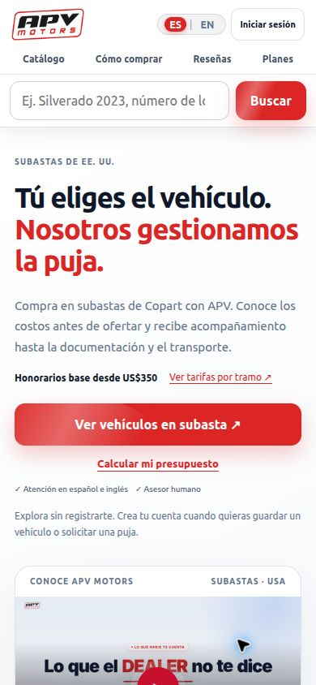
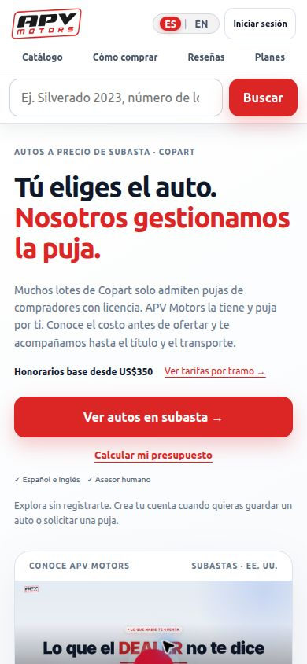
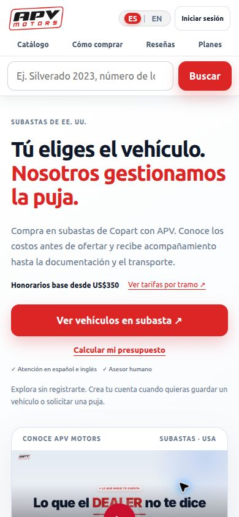
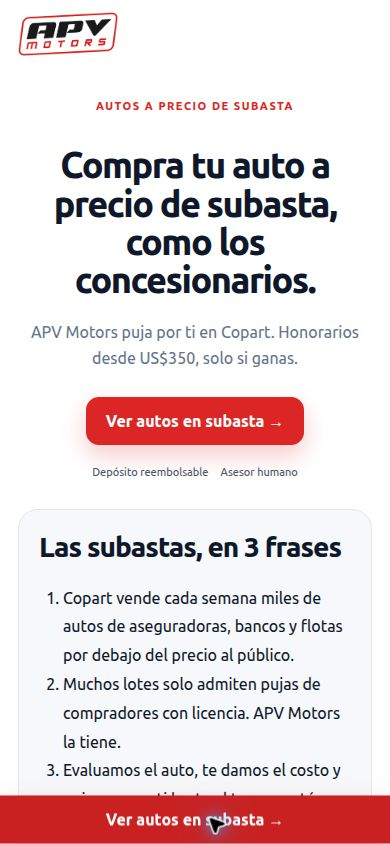

# Reporte: home P0 y landing de campaña

Rama `feat/home-p0-y-landing`. Trabajo local; **sin push, merge ni despliegue**. Base de comparación: `e182375`. Fecha de entrega: 2026-09-27T17:32:13+00:00.

## 1. Resumen

- Home reorganizada según el orden solicitado; cuatro pasos, reseñas antes del presupuesto y costos/depósito juntos.
- `/lp` reutiliza secciones y modales existentes, con tres variantes, presupuestos y CTA móvil.
- `/go` asigna un grupo persistente y conserva parámetros; las fichas conservan la campaña.
- Cookies compactas; atribución propia, GA4 y Meta condicionados según lo solicitado.
- Metadatos de servidor por lote, 404 real, robots, sitemap y recursos sociales.
- Etiquetas de catálogo/ficha traducidas; valores desconocidos ocultos y destacados con precios reales.
- Reseñas existentes como respaldo; Places y Meta listos pero inactivos sin credenciales.
- Se conservan precios, cobro, verificación, calculadora bloqueada y flujo de puja.
- 43 pruebas automatizadas aprobadas; Lighthouse local cumple LCP/CLS y obtiene 100 en accesibilidad.
- Quedan revisión legal, datos de proveedores, 125 claves TODO_EN y validación de recepción real de eventos.

## 2. Antes y después

| Home antes | Home después |
|---|---|
|  |  |

| `/lp` antes | `/lp` después |
|---|---|
|  |  |

Antes no existía la landing: `/lp` devolvía la home por el fallback del servidor. Su captura no representa una campaña anterior.

En [qa](qa/) están los primeros pantallazos y páginas completas, móvil 390×844 y escritorio 1440×900, con y sin cookies: home, variantes ahorro/primera-vez/conocedor, catálogo y ficha. El banner mide aproximadamente 55 px en móvil y 44 px en escritorio; el CTA del hero permanece visible. Las capturas de ficha completa incluyen el fondo bajo el modal fijo. Capturas iniciales con recorte explícito para evitar el recorte automático de Chrome.

## 3. Cambios por archivo

| Archivo | Cambio |
|---|---|
| `server.js` | Rutas /lp y /go; config pública; reseñas/consentimiento; SSR/404/robots/sitemaps; atribución y eventos opcionales en registro/puja. |
| `services/marketing.js` | Cookies, variantes A/B, SSR seguro, Places con caché 24 h, tablas auxiliares de atribución/consentimiento y CAPI con hash/deduplicación. |
| `services/campaignConfig.js` | Variantes ES/EN y depósito provisional 10 %, mínimo US$600. |
| `services/landingPage.js` | Composición de landing desde bloques de home; reutilización de catálogo, ficha y cuenta. |
| `services/catalogDb.js` | Elegibilidad de destacados y límites de rangos de presupuesto, sin cambiar valores internos de filtros. |
| `services/kommo.js` | Origen como nota adicional y clave de deduplicación; mantiene sincronización existente. |
| `public/index.html` | Orden, copy, anclas, cuatro pasos, cookies, privacidad, footer, marcas de componentes compartidos. |
| `public/catalog.html` | Scripts compartidos, etiquetas, footer/cookies; elimina H1 de 0 px. |
| `public/app.js` | Etiquetas/ficha, destacados, i18n, atribución opcional, eventos y conservación de campañas; guardas para LP. |
| `public/home.js` | Carrusel admite reseñas dinámicas usando el comportamiento existente. |
| `public/marketing.js` | Configuración visual, chips, reseñas reales y licencia. |
| `public/marketing-i18n.js` | Textos ES/EN, adición de privacidad y claves TODO_EN. |
| `public/vehicle-labels.json` | Diccionario compartido de etiquetas del proveedor. |
| `public/tracking.js` | Consentimiento, scripts opcionales, eventos, enlaces de campaña y referencias WhatsApp. |
| `public/campaign.css` | Presentación home/LP, banner, contraste, áreas táctiles y ajustes de ficha. |
| `public/membership.js` | Solo las dos correcciones de texto del plan Gratis. |
| `public/kommo.js` | Adjunta atribución opcional al payload existente. |
| `public/404.html` | Error de marca con búsqueda y acceso al catálogo. |
| `public/assets/og-default.jpg`, `public/favicon.ico` | Imagen social 1200×630 creada con póster/logo y favicon. |
| `.env.example` | Variables opcionales sin secretos. |
| `test/marketing.test.js`, `test/tracking.test.js` | Cookies, variantes, metadatos, composición, hashes/consentimiento y eventos con proveedores simulados. |
| `test/catalog.test.js`, `test/http-performance.test.js` | Rangos/eligibilidad y expectativas del nuevo HTML servido. |
| `docs/PLAN_CAMBIOS.md`, `docs/TODO_EN.json`, `docs/qa/`, este reporte, `CHANGELOG.md` | Plan previo, traducciones pendientes y evidencia reproducible. |

Se conservan `home-legacy-hooks` y `section#catalogo[hidden]`: app.js sí usa sus elementos y listeners. En LP los hooks de navegación quedan ocultos/inertes y no se muestran al visitante. No se duplicó la lógica de ficha, registro o carrusel. El sitemap usa un índice con páginas y fragmentos de vehículos (máximo 45.000 URL por fragmento), por el tamaño real del inventario.

### Léxico y etiquetas

- Home/LP: auto/autos para marketing; vehículo para depósito, pago y honorarios; camioneta en etiquetas de carrocería.
- Catálogo/destacados: Prende y corre, Cómprala ya, Título limpio, Valor al público est.; precios comparativos informativos, sin prometer ahorro.
- Ficha: Subasta, Análisis de precio, Daños y condición, Información del vehículo, Venta sin reserva, Vendedor de Copart, Por confirmar, Automática, Tracción delantera/total, Gasolina, cil. y mapas de colores/daños. Los valores del proveedor sin traducción permanecen originales, conforme a la excepción solicitada.
- Evaluación y ficha coinciden en «Solicitar historial elaborado por APV».
- N/A y N/D se ocultan como campos, sin ocultar acciones válidas de la ficha.

Conteo de las capturas DOM móviles (singular/plural agrupados; no es un conteo de toda la base de inventario):

| Página | auto | vehículo | carro | coche |
|---|---:|---:|---:|---:|
| Home | 17 | 15 | 0 | 0 |
| LP ahorro | 20 | 4 | 0 | 0 |
| LP primera vez | 19 | 4 | 0 | 0 |
| LP conocedor | 15 | 4 | 0 | 0 |
| Catálogo | 1 | 1 | 0 | 0 |
| Ficha | 1 | 3 | 0 | 0 |

Evidencia: [lexicon.json](qa/lexicon.json). No se alteraron los valores de API/filtros para traducirlos. Las 125 claves de [TODO_EN.json](TODO_EN.json) conservan ES en modo EN, según la opción permitida; la traducción editorial completa sigue pendiente.

## 4. Pruebas y Lighthouse

Mediana de tres corridas móviles Lighthouse 13.5.0 por página, servidor local; no son métricas de producción ni de usuarios reales.

| Página | LCP | CLS | Rendimiento | Accesibilidad |
|---|---:|---:|---:|---:|
| Home antes | 2,364 s | 0,0700 | 97 | 94 |
| Home después | 2,364 s | 0,0689 | 97 | 100 |
| LP después | 1,972 s | 0,0367 | 99 | 100 |

La velocidad de la home permanece esencialmente igual; cumple ≤2,5 s y CLS ≤0,1. No hay medición «antes» comparable de LP porque no existía. Se difirió JS y agregó CSS crítico. No existe una fuente web del titular que precargar: se mantuvo la pila del sistema sin introducir una descarga artificial.

- `npm test`: **43/43**; [salida](qa/tests.txt), [métricas y nueve informes](qa/lighthouse-summary.json).
- Chrome con API Playwright: rutas, variantes, banner, rangos y navegación a ficha en dos tamaños. Se usó origen local anónimo separado; la herramienta no permite crear un contexto limpio formal ni leer cookies del navegador. Atribución/cookies se comprobaron con cliente HTTP y pruebas aisladas.
- `curl -A facebookexternalhit/1.1`: títulos/OG presentes sin JS en home, LP, catálogo y lote; 404 real; robots plano; sitemap XML válido sin LP/go. [Evidencia](qa/http-checks.json).
- `/go?utm_source=test&utm_campaign=qa&v=primera-vez`: parámetros preservados hasta la ficha; primera fuente persistente y grupo estable verificados por HTTP. [URL real en Chrome](qa/campaign-navigation.txt).
- «Aceptar todas» añade el script GA4; «Solo esenciales» lo elimina tras recarga y no carga Meta. [Evidencia DOM](qa/consent-browser.json). Pruebas simuladas verifican eventos, consentimiento y `event_id` compartido.
- **Limitación pendiente:** no se verificó recepción de hits en la red/DebugView de GA4 ni Meta Test Events. La API de Chrome disponible no expone inspección de red. Meta carece de credenciales; CAPI se probó con transporte simulado. No se presentan estas pruebas como validación de ingestión real.
- No se enviaron formularios reales ni se crearon cuentas en producción. Pruebas en servidores locales 3015 (cambio) y 3016 (base).

## 5. PENDIENTE DE VALIDACIÓN LEGAL

Textos exactos y ubicaciones:

1. Hero home: «Muchos lotes de Copart solo admiten pujas de compradores con licencia. APV Motors la tiene y puja por ti. Conoce el costo antes de ofertar y te acompañamos hasta el título y el transporte.»
2. Descripción SEO home: «Compra autos de Copart con APV Motors. Pujamos por ti con licencia de dealer. Honorarios desde US$350 y depósito reembolsable.»
3. FAQ licencia home/LP: «Sí. Pujamos en tu nombre con la licencia de dealer de APV Motors. Algunos lotes tienen restricciones según el estado o el tipo de título; te lo confirmamos antes de pujar.»
4. Introducción LP: «Muchos lotes solo admiten pujas de compradores con licencia. APV Motors la tiene.»
5. Variante primera-vez: «Elige el auto, conoce el costo y nosotros pujamos por ti con nuestra licencia.»
6. Costos home/LP: «Los honorarios solo se cobran si ganas, y nunca en el mismo pago que tu depósito.»
7. Depósito: «Tu depósito es reembolsable y habilita tu puja. 10 % de tu tope, mínimo US$600. Se confirma con tu asesor antes de pujar.» **Cifra provisional**, centralizada en configuración.
8. Reglas del depósito: «Queda activo para tu próxima puja o te lo devolvemos completo.» / «Pagas el vehículo por transferencia bancaria y aplicamos tu depósito según las condiciones.» / «La subasta aplica penalidades según las condiciones que aceptaste.»
9. FAQ depósito: «Es un monto reembolsable que habilita tu puja: 10 % de tu tope, mínimo US$600. Si no ganas, queda activo para otra puja o te lo devolvemos. Tu asesor confirma el monto antes de pujar.»
10. FAQ tarjeta: «No. El vehículo se paga por transferencia bancaria. La tarjeta solo puede usarse para el depósito.»
11. Introducción LP, afirmación comercial pendiente de sustento: «Copart vende cada semana miles de autos de aseguradoras, bancos y flotas por debajo del precio al público.»
12. Privacidad, sección 6, **PENDIENTE DE REVISIÓN LEGAL**: «Con su consentimiento para todas las cookies, usamos Google Analytics y Meta (píxel y Conversions API) para medir visitas, registros y solicitudes de puja. Los identificadores enviados por el servidor a Meta se transforman mediante SHA-256. Kommo gestiona las conversaciones y solicitudes. La cookie propia apv_src conserva el origen inicial durante 90 días para atribución interna; apv_ab conserva su grupo de prueba durante 30 días. Su elección de cookies se guarda en este navegador y, si inicia sesión, con su cuenta.»

También debe revisarse su traducción EN en `public/marketing-i18n.js`. Estos textos no modifican las reglas reales de cobro existentes.

## 6. Variables y datos pendientes

| Variable/dato | Estado |
|---|---|
| `GA4_MEASUREMENT_ID` | ID existente migrado a entorno local ignorado por Git; configurar también al desplegar. |
| `META_PIXEL_ID`, `META_CAPI_TOKEN` | No configurados; Pixel/CAPI inactivos. |
| `META_API_VERSION` | Opcional; valor por defecto v23.0. Validar versión e integración con Meta Test Events antes de activar. |
| `GOOGLE_PLACES_API_KEY`, `GOOGLE_PLACE_ID` | No configurados; no hay rating/total inventado ni sello agregado. |
| `DEALER_LICENSE_NO` | Pendiente; muestra `[LICENCIA_NO]`. |
| `PUBLIC_SITE_URL` | Configurar dominio canónico de destino si difiere del predeterminado. |
| Depósito 10 % / US$600 | `services/campaignConfig.js`, `provisional: true`; confirmar con negocio/legal. |
| Subtítulos | No se encontró VTT/transcripción; TODO en video. MP4 y póster no se editaron. |
| Traducciones | 125 claves TODO_EN pendientes; variantes principales sí incluyen EN. |

El enlace proporcionado resuelve a **Apv Motor USA**, CID `5503275909198785895`, identificador Maps `0x8640d0a9aa205555:0x4c5f904824c22d67`. **No fue posible verificar su Google Places Place ID**: CID no sustituye `GOOGLE_PLACE_ID`. Hace falta confirmar la ficha y obtener su ID de Places. El usuario señala otra ficha, **Apv Motors LLC**, con **221 reseñas** y `apvmotordealer.com`; esa cifra no se verificó en vivo ni se publica como propia.

Se mantienen tres reseñas existentes sin fecha «consultadas…» y sin inventar rating. Si se configura Places, se consultan detalles y reseñas con caché de 24 h. Se eligió [Place Details Legacy](https://developers.google.com/maps/documentation/places/web-service/legacy/details) por `reviews_sort=newest`; la API entrega un subconjunto limitado, del que se seleccionan hasta cinco reseñas con texto y 4–5 estrellas, priorizando menciones a APV Motors. Puede haber menos de cinco: no se garantiza acceder a todas las reseñas de Google. Revisar permisos/atribución/condiciones del proveedor al activar la clave.

## 7. Decisiones NO implementadas

- **D-082:** calculadora sin registro; conserva bloqueo y comentario pendiente.
- **D-148:** SMS; permanece verificación por correo.
- **D-153:** sustituir WhatsApp; permanecen los enlaces con atribución.
- **D-006:** cambiar cobro de planes; no se cambió precio, renovación, Stripe ni beneficios.
- **/en/**: no creado. El idioma actual es estado cliente; requiere SSR multilingüe, rutas, canonical/hreflang y revisión de plantillas. Estimación inicial: 2–4 días adicionales, pendiente de alcance.

## 8. Botón «Elegir APV Plus»

El comportamiento previo continúa: sin sesión abre el acceso/registro con intención de suscripción. Con sesión llama a `/api/billing/checkout` y redirige al Checkout existente; para una suscripción con cliente activo ofrece el portal. Si la facturación no está disponible, el botón de pago está deshabilitado. No abre WhatsApp ni cobra automáticamente con solo mostrar la página. No se ejecutó una compra para comprobarlo. Precios US$0 / US$97 / US$297 y periodicidad existente sin cambios.

## 9. WhatsApp restante

| Superficie visible | Enlaces | Código |
|---|---:|---|
| Home: depósito | 1 | `[ref:home-deposito]` |
| Home: ayuda FAQ | 1 | `[ref:home-ayuda]` |
| Home: CTA final | 1 | `[ref:home-final]` |
| Landing: CTA final | 1 | `[ref:lp-final]` |
| Catálogo base | 0 | — |
| Ficha: compartir por WhatsApp | 1 por ficha abierta | `[ref:vehicle-contact]` |

Son tres enlaces en home, uno en LP y uno dinámico en ficha. Los hooks ocultos reutilizados no se cuentan como enlaces visibles. No se enviaron mensajes. Todos registran `whatsapp_click` únicamente con consentimiento de medición.

## 10. Enlaces de campaña y revisión

Ejemplo para publicar tras aprobar/desplegar:

`https://cars.apvmotorusa.com/go?utm_source=instagram&utm_medium=organic&utm_campaign=lanzamiento&v=ahorro`

Variantes: `ahorro`, `primera-vez`, `conocedor`. `/go` responde 302 con grupo home/lp 50/50 y cookie de 30 días; mantiene todos los parámetros y añade `ab_bucket`. `force=home` o `force=lp` permite QA sin guardar la asignación forzada. `apv_src` conserva la primera entrada por 90 días; `ab_assign` se emite tras aceptar medición.

Previsualización local: [home](http://localhost:3015/) · [campaña](http://localhost:3015/lp) · [primera vez](http://localhost:3015/lp?v=primera-vez) · [conocedor](http://localhost:3015/lp?v=conocedor).

La entrega queda lista para revisión de código y diseño. La activación de proveedores, revisión legal y validación externa de eventos siguen pendientes antes de publicar.

## Revisión de estructura móvil — 2026-09-27T19:19:47+00:00

Actualización posterior a la entrega inicial, en `feat/landing-reference-layout`. La referencia nueva sustituye la restricción anterior de no incluir video en /lp. Se reutilizan el video y reproductor actuales, sin editar el archivo. Hero por defecto: «Compra tu vehículo en subastas de EE. UU. 100 % online.». Las variantes de campaña conservan sus otros mensajes.

Se añaden las entradas «Es mi primera vez» y «Ya conozco las subastas», el presupuesto antes de destacados y cuatro pasos después. Respaldo de marca/evaluación y reseñas se sitúan después de costos/depósito. No se copian cifras de ejemplo, años de experiencia, calificaciones ni fotos de clientes sin verificar. Se mantiene la reserva explícita para gastos adicionales del presupuesto existente, evitando prometer un precio final garantizado. Nuevos textos con ES/EN.

Validación: 43 pruebas aprobadas; HTML servido con video y scripts compartidos, orden correcto y sin IDs duplicados. Chrome no estuvo disponible en esta sesión: revisión visual y capturas nuevas pendientes. Las capturas y métricas anteriores corresponden a la versión anterior, no a esta reorganización. Esta revisión no se ha subido ni desplegado.

## Validación en Chrome — 2026-09-27T19:24:18+00:00

Completada la revisión pendiente de la landing local en Chrome, móvil 390×844 y escritorio 1440×900. Sin desbordamiento horizontal en ambos tamaños y sin errores de consola observados durante la revisión.

- Video: reproducción y pausa verificadas, contador avanzó a 0:06 de 2:09.
- Accesos del hero: navegación a explicación y presupuesto.
- Presupuesto: US$10.000 total y US$2.000 de reserva devuelven US$6.637 de tope, US$8.000 de compra estimada y US$10.000 total orientativo.
- Carrusel: siguiente cambia de 1 de 3 a 2 de 3.
- FAQ de pago con tarjeta: abre la respuesta.
- Destacados: botón abre ficha `/vehiculo/58573556`. No se enviaron pujas ni formularios de cuenta.
- Corregido salto de línea entre «100» y «%».
- Corregida duplicación/superposición del CTA fijo: queda oculto mientras el hero es visible y aparece al salir de él. Con banner móvil, CTA principal termina aproximadamente en y=741 y banner comienza en y=789 (alto 55 px).
- 43/43 pruebas automatizadas aprobadas después de corregir. No se repitió Lighthouse; las métricas anteriores no corresponden a esta revisión.

Capturas nuevas: [móvil con cookies](qa/lp-reference-mobile-cookies.jpg), [móvil completo](qa/lp-reference-mobile-full.jpg), [escritorio](qa/lp-reference-desktop.jpg).

## 2026-09-27T19:33:55+00:00 — Corrección de alcance de los heroes

La simplificación corresponde a la página principal: «Compra tu vehículo en subastas de EE. UU. 100 % online.» y descripción breve. /lp recupera «Compra tu auto a precio de subasta, como los concesionarios.», con hero centrado y video debajo del título y subtítulo en móvil/escritorio. «Ya conozco las subastas» apunta a /. Validado en Chrome y 43 pruebas aprobadas. Cambios locales sin push. Las capturas anteriores reflejan el diseño previo a esta corrección.

## 2026-09-27T20:06:42+00:00 — Comparación visual basada en compra inmediata

Los destacados requieren Buy Now mayor que cero y valor al público válido, conservando los demás criterios de selección. Comparación en tarjetas con dos importes, barra proporcional y porcentaje solo si compra inmediata está por debajo del valor al público. Nunca se usa la puja actual para calcular la diferencia. Se aclara que tarifas, transporte y reparaciones no están incluidos. Catálogo general conserva sus filtros y no muestra comparación cuando falta Buy Now.

43 pruebas aprobadas, incluyendo exclusión de lotes con solo puja y rangos calculados por compra inmediata. Validación DOM en Chrome con lote 62681826: US$600 contra US$13.150, diferencia 95,4 %. Inventario local: cuatro lotes con Buy Now, ninguno cumple además los criterios de destacados; se muestra el estado vacío en lugar de sustituirlos por pujas. Sin push.

## 2026-09-27T20:11:13+00:00 — Restauración de precios y destacados

Se restaura la selección previa de destacados, que admite puja o compra inmediata, manteniendo la comparación gráfica exclusivamente con Buy Now y retail válidos. Se restauran ambos campos de precio en destacados y se mantienen visibles en catálogo; cuando el proveedor no aporta un precio positivo, muestran «Por confirmar», sin inventar importes. Chrome confirma seis destacados y ambos campos. 43 pruebas aprobadas. Esta corrección sustituye la restricción Buy Now obligatoria descrita anteriormente.

## 2026-09-27T20:20:36+00:00 — Comparación compacta y selección propia de landing

Precios ausentes vuelven a N/A y permanecen visibles. Bloque comparativo con menos espacio y barra más fina. /lp solicita campaign=1: Buy Now positivo y menor que retail, con foto y tipo de vehículo admitido; no impone año mínimo, daños menores ni condición Prende y corre. La home conserva su selección previa. Cachés independientes, invalidadas juntas con el inventario. Chrome confirma cuatro vehículos reales, incluyendo US$2.950 frente a US$9.500 (68,9 %); sin desbordamiento móvil. 44 pruebas aprobadas. No se compara puja contra retail. Sin push.

## 2026-09-27T20:31:42+00:00 — Catálogo móvil compacto

Datos de ubicación, daños, documento, condición, carrocería, color, odómetro y especificaciones agrupados en «Ver datos del vehículo», cerrado inicialmente hasta 700 px. Foto, nombre, precios, comparación Buy Now y acción de oferta permanecen visibles. En escritorio los datos están abiertos sin control desplegable. Cambio de tamaño sincroniza el estado. Chrome 390×844: tarjetas medidas de 430–437 px cerradas, ejemplo de 749 px abierto; apertura/cierre funcional. En 1440×900 los datos quedan abiertos y no hay desbordamiento horizontal. 44 pruebas aprobadas. Sin push.
